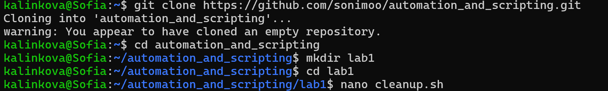
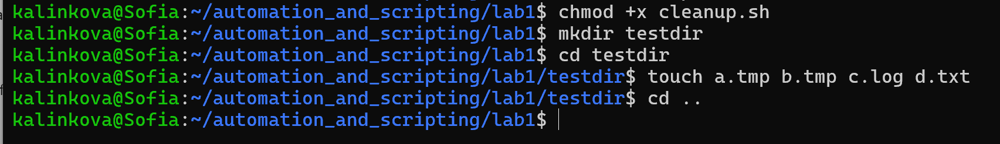
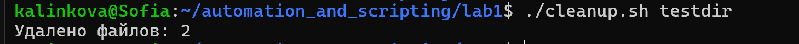
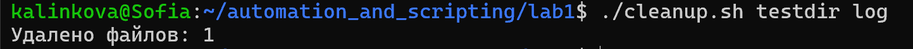
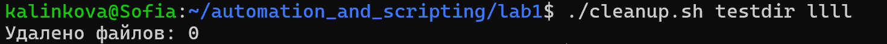
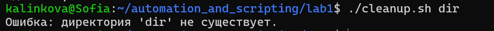

# Лабораторная работа №1. Написание простого Shell-скрипта для автоматизации задач.
 
 - **Калинкова София, I2302** 
 - **14.09.2025** 

## Цель работы

Научиться создавать и выполнять простые скрипты Shell для автоматизации рутинных задач в операционной системе Linux.

## Задание

Очистка временных файлов:
1. Скрипт должен иметь имя cleanup.sh;
2. Скрипт должен принимать как минимум один аргумент: путь к каталогу, который нужно очистить;
3. Остальные аргументы необязательны и указывают типы файлов для удаления (например, .tmp, .log);
4. По умолчанию файлы с расширением .tmp удаляются;
5. По завершении выполнения скрипта он должен вывести количество удалённых файлов;
6. Скрипт должен проверить существование указанного каталога и вывести соответствующие сообщения об ошибках.

## Описание выполнения работы с ответами на вопросы

### Подготовка


создаем папку для лабораторной работы и файл `cleanup.sh`.

### Выполнение

#### Код скрипта:

```bash
#!/bin/bash

# Проверка, что указан хотя бы один аргумент
if [ $# -lt 1 ]; then
    echo "Ошибка: нужно указать путь к директории."
    echo "Использование: $0 <директория> [расширения...]"
    exit 1
fi

DIR=$1
shift   # убираем первый аргумент (директория), остальные — расширения

# Проверяем, что директория существует
if [ ! -d "$DIR" ]; then
    echo "Ошибка: директория '$DIR' не существует."
    exit 1
fi

# Если расширения не указаны, используем .tmp по умолчанию
if [ $# -eq 0 ]; then
    EXTENSIONS=("tmp")
else
    EXTENSIONS=("$@")
fi

# Счётчик удалённых файлов
count=0

# Удаляем файлы с указанными расширениями
for ext in "${EXTENSIONS[@]}"; do
    files=$(find "$DIR" -type f -name "*.$ext")
    for file in $files; do
        rm -f "$file"
        ((count++))
    done
done

echo "Удалено файлов: $count"

```

#### Разбор скрипта `cleanup.sh`

**1. Проверка аргументов**
```bash
if [ $# -lt 1 ]; then
    echo "Ошибка: нужно указать путь к директории."
    echo "Использование: $0 <директория> [расширения...]"
    exit 1
fi
```

`$#` — количество аргументов, переданных скрипту.

Если аргументов меньше одного, выводится сообщение об ошибке и пример использования.

`exit 1` завершает выполнение с кодом ошибки.

**2. Сохранение пути и сдвиг аргументов**
```bash
DIR=$1
shift
```


`$1` — первый аргумент (путь к папке).

`shift` удаляет первый аргумент, теперь $@ будет содержать только список расширений

**3. Проверка существования директории** 

```bash
if [ ! -d "$DIR" ]; then
    echo "Ошибка: директория '$DIR' не существует."
    exit 1
fi
```

**3. Определение расширений**
```bash
if [ $# -eq 0 ]; then
    EXTENSIONS=("tmp")
else
    EXTENSIONS=("$@")
fi
```

Если дополнительных аргументов нет `($# -eq 0)`  используем `tmp` по умолчанию.

Если аргументы есть - записываем их в массив EXTENSIONS.

**5. Счётчик удалённых файлов**
`count=0`

**6. Цикл удаления файлов**
```bash
for ext in "${EXTENSIONS[@]}"; do
    files=$(find "$DIR" -type f -name "*.$ext")
    for file in $files; do
        rm -f "$file"
        ((count++))
    done
done
```

Внешний `for` перебирает расширения (tmp, log и т. д.).

`find "$DIR" -type f -name "*.$ext"` ищет все файлы с нужным расширением.

Внутренний `for` перебирает найденные файлы.

`rm -f "$file"` удаляет файл (опция `-f` убирает лишние предупреждения).

`((count++))` увеличивает счётчик на 1.

**7. Вывод результата**
```bash
echo "Удалено файлов: $count"
```

В конце скрипт сообщает пользователю, сколько файлов было удалено.


##### Делаем скрипт исполняемым

```bash
chmod +x cleanup.sh
```

#### Создаём тестовую директорию и файлы
```bash
mkdir testdir
cd testdir
touch a.tmp b.tmp c.log d.txt
cd ..
```



#### Запуск и тестирование

Запуск скрипта (по умолчанию удаляются .tmp)

```bash
./cleanup.sh testdir`
```



Запуск с расширениями (.log)

```bash
./cleanup.sh testdir log
```



Запуск с неверным расширением



Проверка ошибки (несуществующая папка)

```bash
./cleanup.sh dir
```



## Вывод

В процессе выполнения лабораторной работы я научилась создавать и запускать простые Shell-скрипты в Linux.
Разработанный скрипт позволяет удалять временные файлы разных типов, гибко настраивается через аргументы командной строки и обеспечивает пользователя удобным выводом результата.
Данный опыт показал, что даже небольшой скрипт может значительно упростить повседневную работу и автоматизировать рутинные процессы.