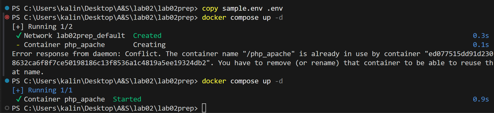
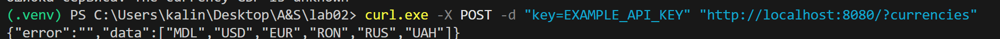
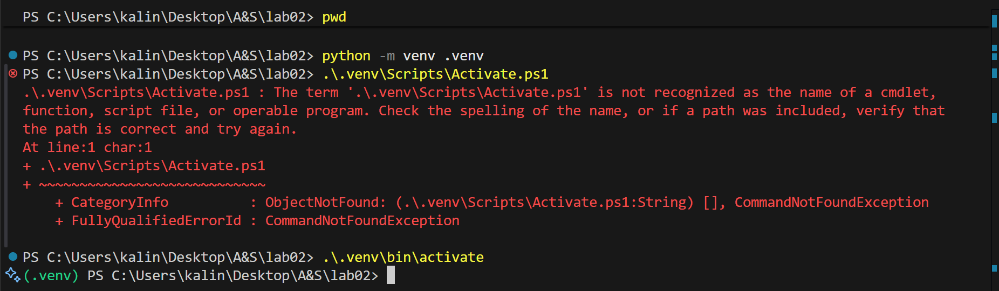
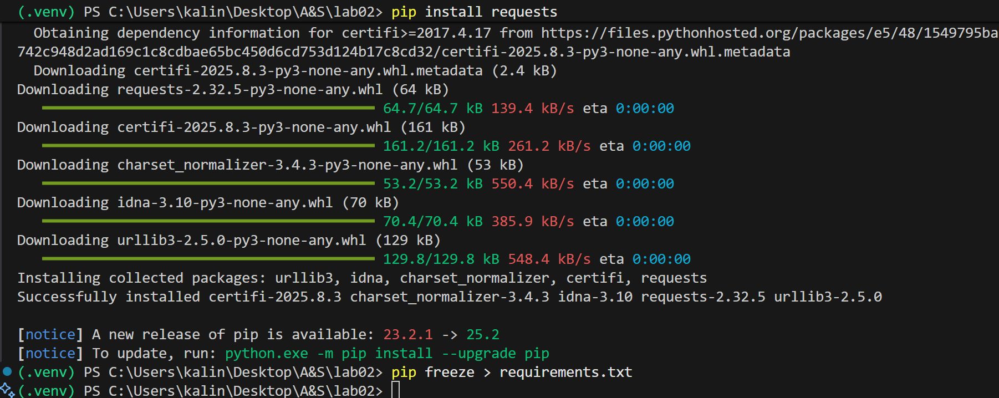
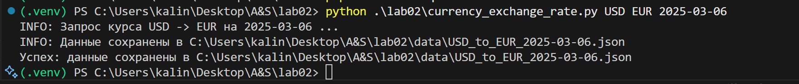
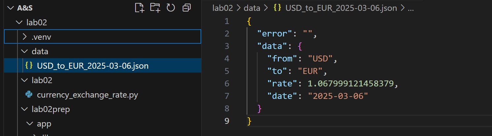
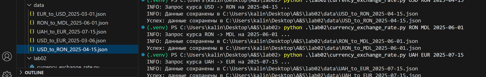
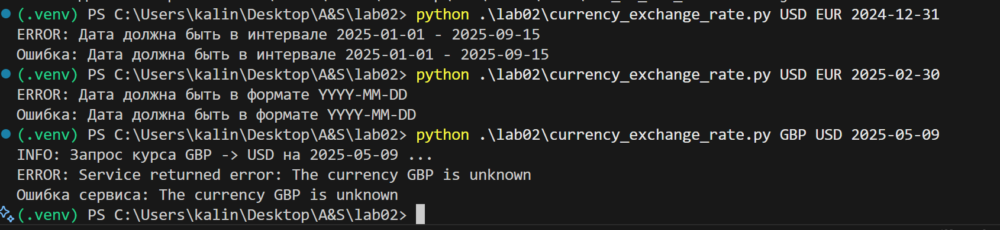
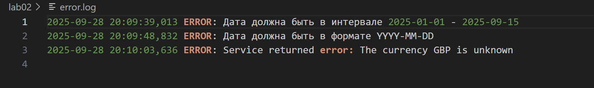

 # Лабораторная работа №2. Создание Python-скрипта для взаимодействия с API
 
 - **Калинкова София, I2302** 
 - **27.09.2025** 

## Цель работы

Изучить взаимодействие Python-скрипта с Web API: отправка HTTP-запросов, обработка полученных данных, сохранение их в файл и обработка ошибок.

## Задание
**В рамках лабораторной работы необходимо:**

1. Создать новый каталог `lab02` и в нём реализовать скрипт `currency_exchange_rate.py`.

2. Скрипт должен выполнять следующие функции:

   - получать курс одной валюты к другой на заданную дату (валюты и дата задаются параметрами командной строки);
   - сохранять результат в JSON-файл, имя которого содержит валюты и дату;
   - сохранять файлы в папку `data`, которую нужно создать, если её нет;
   - обрабатывать ошибки и выводить понятные сообщения (также писать их в файл `error.log`);
   - поддерживать вывод списка доступных валют;
   - корректно работать при разных наборах параметров.

3. Протестировать работу скрипта на диапазоне дат от **2025-01-01 до 2025-09-15** (не менее 5 дат с равными интервалами).

4. Подготовить файл `readme.md`, в котором описать:

   - установку зависимостей;
   - примеры запуска скрипта;
   - описание структуры кода.

##  Ход работы

Для нужно распаковать архив, также создаю папку, в корой будет скрипт на python.

1) Поднять локальный сервис (Docker)

Перехожу в папку сервиса, создаю .env из sample.env, поднимаю сервис.




После этого, была введена следующая команда:



Эта команда с помощью curl отправляет POST-запрос на локальный сервер http://localhost:8080/?currencies.
В теле запроса передаётся ключ key=EXAMPLE_API_KEY.
Сервер в ответ возвращает JSON со списком доступных валют (MDL, USD, EUR и т.д.).

2) Настройка Python-окружение и зависимости



Краткое описание проделанных действий:

- переход в корень проекта
- создание виртуального окружения
- Осуществлена попытка активации окружения командой:
```powershell
.\.venv\Scripts\Activate.ps1
```
Однако активация не сработала, так как у созданного окружения отсутствует папка Scripts

- Выяснилось, что Python создал Linux-подобную структуру (папки bin, lib вместо Scripts), что характерно для WSL. Поэтому активация была выполнена командой:
```powershell
.\.venv\bin\activate
```



- После активации виртуального окружения (появилась метка (venv) в начале строки) были выполнены следующие действия:

    - установка необходимого пакета requests: `pip install requests`
    - сохранение списка зависимостей в файл requirements.txt: `pip freeze > requirements.txt`

3) Код в currency_exchange_rate.py

Краткая структура скрипта:

- **Парсинг аргументов (argparse):** FROM, TO, DATE, --key. Скрипт принимает исходную валюту, целевую валюту, дату и опциональный API-ключ.

- **Загрузка API-ключа:** приоритет --key → переменная окружения API_KEY → значение по умолчанию.

- **Валидация даты:** функция validate_date() проверяет формат YYYY-MM-DD и диапазон допустимых дат.

- **Вызов сервиса:** функция call_service() отправляет POST-запрос с API-ключом и параметрами from, to, date к локальному сервису.

- **Сохранение результата:** функция save_json() сохраняет ответ сервиса в data/<FROM>_to_<TO>_<DATE>.json (UTF-8, с отступами).

- **Логирование:** функция setup_logging() выводит INFO-сообщения в консоль и пишет ошибки (сеть, HTTP, API, валидация) в error.log.

4) Тестирование





После запуска с датой в допустимом диапазоне, создается json с заданной датой и валютами в папке data, а также выводится соответсвующее сообщение.



Так же были были протестированы и другие "правильные даты", например:
```
# 2. Курс EUR → USD в марте
python .\lab02\currency_exchange_rate.py EUR USD 2025-03-01

# 3. Курс USD → RON в апреле
python .\lab02\currency_exchange_rate.py USD RON 2025-04-15

# 4. Курс RON → MDL в июне
python .\lab02\currency_exchange_rate.py RON MDL 2025-06-01

# 5. Курс UAH → EUR в июле
python .\lab02\currency_exchange_rate.py UAH EUR 2025-07-15
```
После так же были произведены проверки с некорректными данными :

```
#  Дата вне диапазона (слишком ранняя)
python .\lab02\currency_exchange_rate.py USD EUR 2024-12-31

# Невалидная дата (февраль 30-го не существует)
python .\lab02\currency_exchange_rate.py USD EUR 2025-02-30

# Неподдерживаемая валюта (например, GBP)
python .\lab02\currency_exchange_rate.py GBP USD 2025-05-09
```



Все сообщения с ошибками записываются в файл error.log.



## Вывод

В ходе выполнения лабораторной работы была изучена практика взаимодействия с веб-API средствами языка Python. В проекте была реализована структура, соответствующая требованиям задания: сервис API был запущен в контейнере Docker, а в отдельном модуле на Python создан скрипт, позволяющий получать курсы валют по указанным параметрам.

Скрипт обрабатывает параметры командной строки, выполняет запросы к API, сохраняет результаты в формате JSON в специально созданной директории data и фиксирует ошибки в журнале error.log. Это позволило отработать навыки работы с HTTP-запросами, обработки исключений и управления структурой проекта.