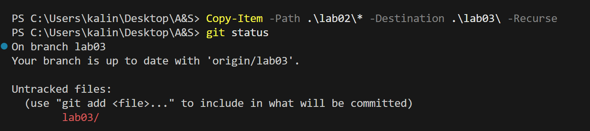
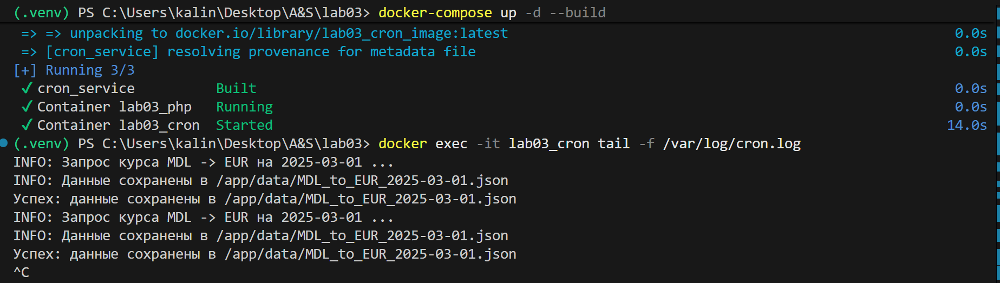
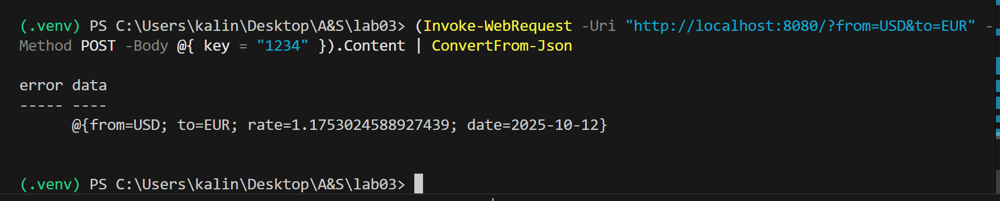

 # Лабораторная работа №3. Настройка планировщика задач (cron)
 
 - **Калинкова София, I2302** 
 - **11.10.2025** 

## Цель работы

Научиться настраивать планировщик задач (cron) для автоматизации выполнения скриптов.

## Подготовка

Задание основано на лабораторной работе №2. поэтомукопирую файлы из лабораторной работы №2 в новую директорию `lab03` для дальнейшей работы.

##  Ход работы

### Создание ветки и папки

В проекте `automation` создаю ветку `lab03`, директорию `lab03` и копирую туда файлы из лабораторной работы №2 (папка `lab02`).


### Создание файла cronjob

В директории `lab03` создаю файл [cronjob](cronjob).

В данном файле пропиcываю задачи cron, которые будут запускать скрипт `currency_exchange_rate.py`:

1. Ежедневно в 6:00 утра для получения курса MDL к EUR за предыдущий день.
2. Еженедельно в пятницу в 17:00 для получения курса MDL к USD за предыдущую неделю.
3. Также чисто в целях проверки создаю еще одну задачу, которая выполняется каждую минуту чтобы наглядно увидеть работу скрипта не дожидаясь дат из предыдущих пунктов

### Создание файла entrypoint

В директории `lab03` создаю файл [entrypoint.sh](entrypoint.sh).

В данном файле прописываю логику запуска cron в контейнере:

1. Создаю лог-файл /var/log/cron.log и назначаю ему права на запись, чтобы все задачи могли туда писать вывод.
2. Запускаю мониторинг лог-файла (tail -f /var/log/cron.log) в фоне для наглядного отслеживания выполнения cron-задач.
3. Запускаю cron-демон в foreground (cron -f), чтобы контейнер не завершался сразу и выполнял все задачи по расписанию.

#### Важно! Формат файлов entrypoint и cronjob

При подготовке файлов entrypoint.sh и cronjob для контейнера были соблюдены следующие требования:

1. Переводы строк LF (Line Feed)
Все файлы были сохранены с переводами строк LF (\n). Это было сделано просто выбрав соответсвующий формат в правом нижнем углу VS Code. Это необходимо, так как Linux ожидает именно такой формат, а стандартный CRLF из Windows может вызвать ошибки запуска:

- для entrypoint.sh — ошибка exec format error;
- для cronjob — задания cron могут быть проигнорированы.

2. Кодировка UTF-8 без BOM
Файлы были сохранены в кодировке UTF-8 без BOM. Это гарантирует корректное чтение скриптов Linux-системой и предотвращает возможное игнорирование первой строки или всего файла cron. Также выбрано в правом нижнем углу VS Code.

### Создание файла Dockerfile

Создаю файл [Dockerfile](Dockerfile) в директории `lab03`, на основе Ubuntu или официального Python образа, который будет:

1. Устанавливать необходимые зависимости для запуска скрипта (cron, Python и необходимые библиотеки).
2. Копировать скрипт `currency_exchange_rate.py`, файл `cronjob` и entrypoint скрипт в контейнер.
3. Настраивать cron для выполнения задач, указанных в файле `cronjob`.
4. Запускать cron в фоновом режиме при старте контейнера.
5. Записывать вывод cron задач в файл `/var/log/cron.log`.

### Изменение файла docker-compose.yml

В файл [docker-compose.yml](docker-compose.yaml) была внесена следующая модификация:

- Добавлен сервис cron_service, который использует Dockerfile из директории lab03 для сборки образа lab03_cron_image.
- Установлен параметр restart: unless-stopped, чтобы контейнер автоматически перезапускался при сбоях.
- Указана зависимость depends_on: php_service, чтобы сервис с cron запускался после запуска PHP-сервиса.

### Запуск и тестирование 

- Сборка и запуск контейнеров:

```
docker-compose up -d --build
```

Контейнеры lab03_php и lab03_cron успешно запущены.

- Проверка cron-задач:

```
docker exec -it lab03_cron tail -f /var/log/cron.log
```

Логи показывают успешное выполнение скрипта и сохранение данных в /app/data.

Для теста использовалась задача, выполняющаяся каждую минуту.




## Вывод

В ходе лабораторной работы была настроена автоматизация запуска Python-скрипта с помощью планировщика задач `cron` в контейнеризированной среде. Создан файл `cronjob` для ежедневного и еженедельного получения курсов валют, а также разработан Docker-контейнер с entrypoint-скриптом для настройки и запуска cron, ведения логов и управления зависимостями.

Тестирование показало, что задачи выполняются корректно, вывод скриптов записывается в /var/log/cron.log, что обеспечивает прозрачность работы и удобство мониторинга. Работа продемонстрировала умение сочетать Docker, cron и Python, реализовать автоматизацию и журналирование выполнения задач.

