# Лабораторная работа №4. Настройка Jenkins для автоматизации задач DevOps
 
 - **Калинкова София, I2302** 
 - **09.11.2025**

## Цель

Научиться настраивать Jenkins для автоматизации задач DevOps, включая создание и управление конвейерами CI/CD.

## Подготовка

Создаем папку `lab04` в репозитории GitHub для хранения всех файлов, связанных с этой лабораторной работой. Установлен Docker и Docker Compose для выполнения задания.

## Ход работы

Создаем `docker-compose.yml` файл и определяем в нем следующие сервисы:

1. **Jenkins Controller**
2. **SSH Agent**

### Подготовка контроллера Jenkins

Прописываем в `docker-compose.yml` файл конфигурацию для сервиса Jenkins Controller:

```yaml
services:
  jenkins-controller:
    image: jenkins/jenkins:lts
    container_name: jenkins-controller
    ports:
      - "8080:8080"
      - "50000:50000"
    volumes:
      - jenkins_home:/var/jenkins_home
    networks:
      - jenkins-network

volumes:
  jenkins_home:
  jenkins_agent_volume:

networks:
  jenkins-network:
    driver: bridge
```

Запускаем контейнер Jenkins Controller с помощью Docker Compose и настраиваем его, следуя инструкциям на экране.

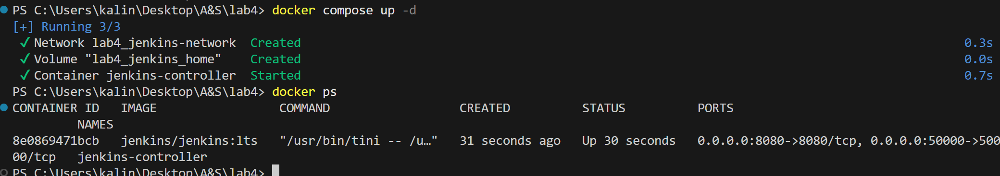

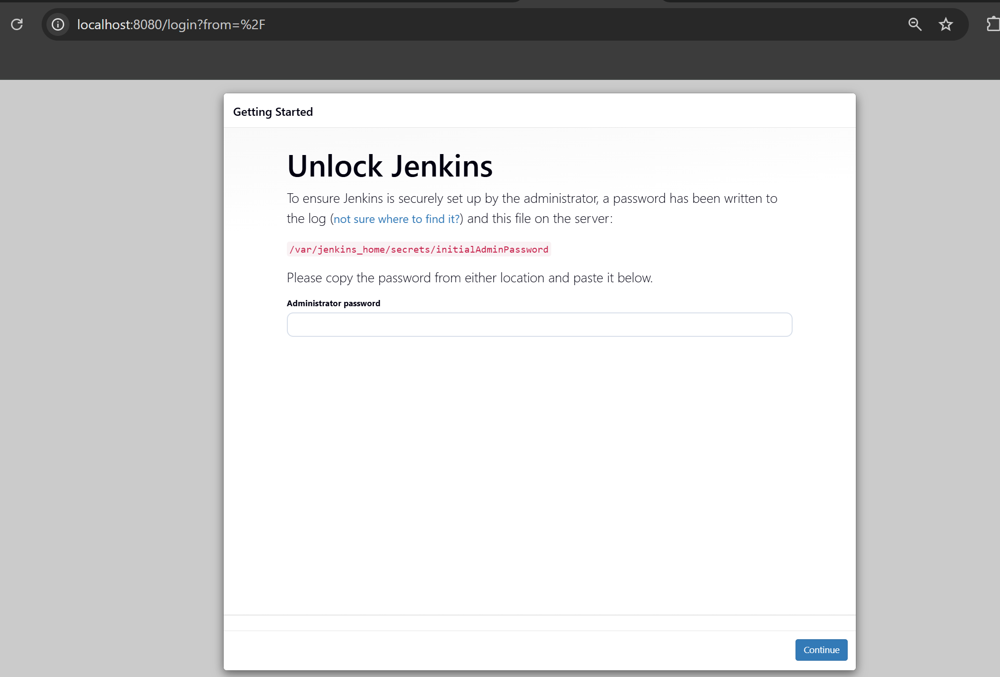

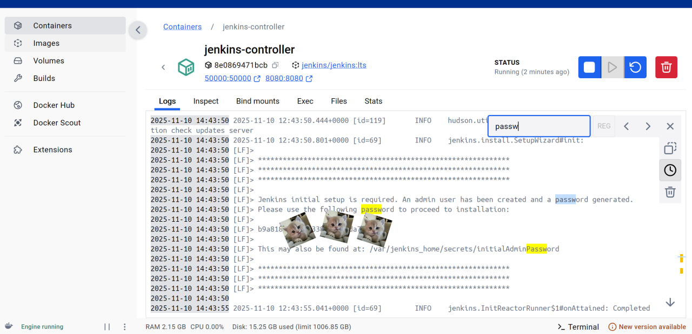

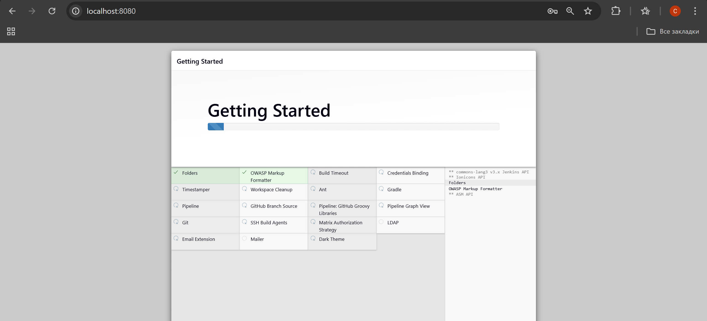

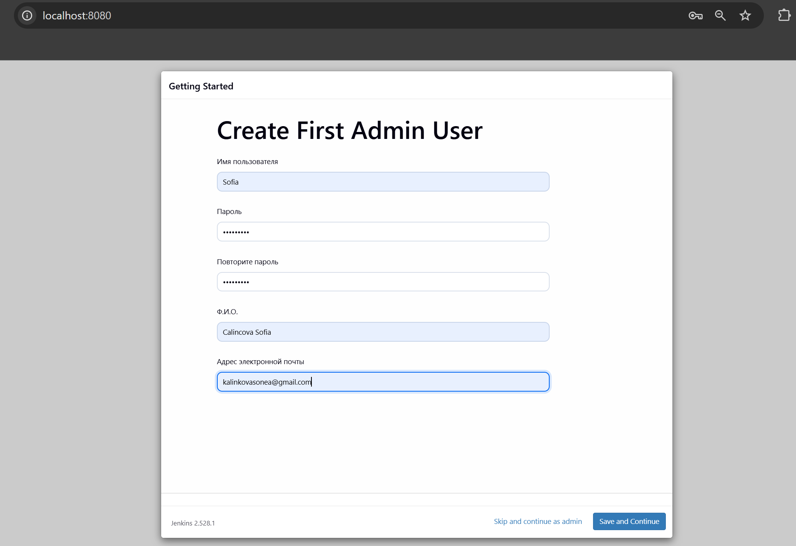
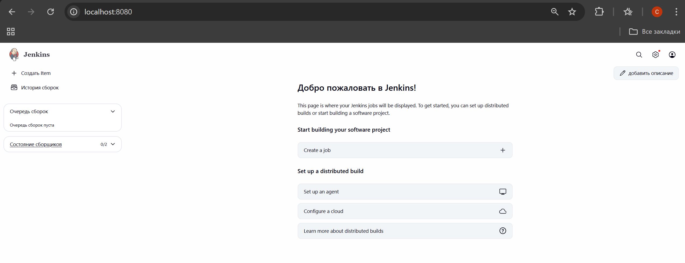


### Подготовка SSH агента

Создаем папку `secrets` в корне проекта и добавьте туда SSH ключи, необходимые для подключения к удаленным серверам.

```bash
mkdir secrets
cd secrets
ssh-keygen -f jenkins_agent_ssh_key
```
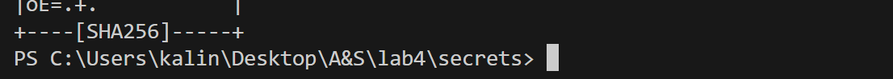


Создаем файл `Dockerfile` для SSH агента с следующим содержимым:

```Dockerfile
FROM jenkins/ssh-agent

# install PHP-CLI
RUN apt-get update && apt-get install -y php-cli
```

Прописываем в `docker-compose.yml` файл конфигурацию для сервиса SSH Agent:

```yaml
  ssh-agent:
    build:
      context: .
      dockerfile: Dockerfile
    container_name: ssh-agent
    environment:
      - JENKINS_AGENT_SSH_PUBKEY=${JENKINS_AGENT_SSH_PUBKEY}
    volumes:
      - jenkins_agent_volume:/home/jenkins/agent
    depends_on:
      - jenkins-controller
    networks:
      - jenkins-network
```

Создаем файл `.env` в корне проекта и добавляем туда переменную окружения `JENKINS_AGENT_SSH_PUBKEY`.

Перезапускаем проект Docker Compose, чтобы применить изменения.

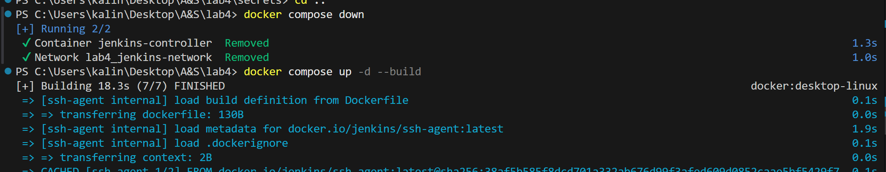


### Подключение SSH агента к Jenkins

Проверили, что в Jenkins установлен плагин "SSH Agents Plugin". 

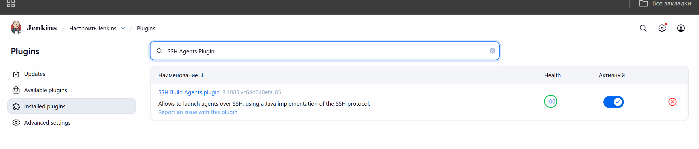

Зарегистрируем SSH ключи в Jenkins:

1. Входим в веб-интерфейс Jenkins по адресу `http://localhost:8080`.
2. Переходим в `Manage Jenkins > Manage Credentials`.

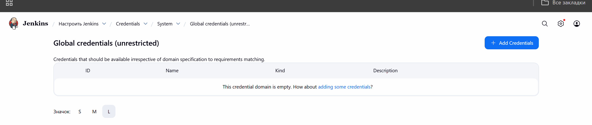

3. Добавляем новый SSH ключ.

| Поле            | Значение                                                             |
| --------------- | -------------------------------------------------------------------- |
| **Kind**        | SSH Username with private key                                        |
| **Username**    | jenkins                                                              |
| **Private key** | Используется приватный ключ из файла `secrets/jenkins_agent_ssh_key` |

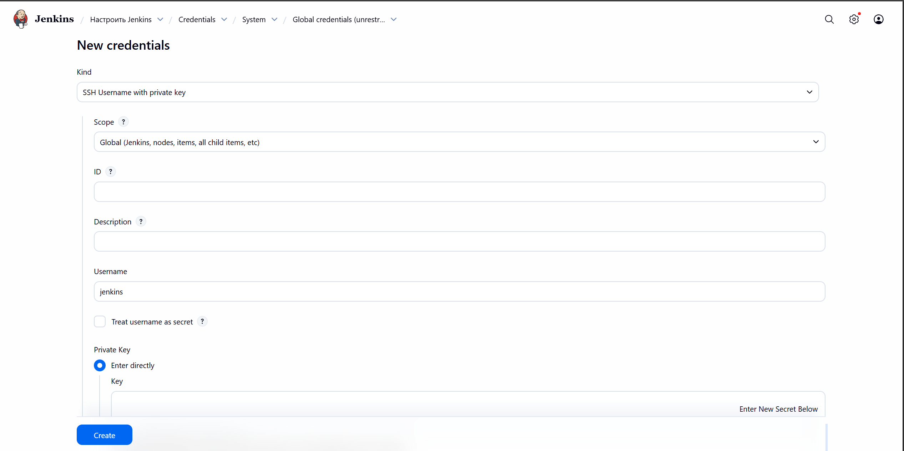


В результате Jenkins теперь имеет возможность аутентифицироваться на агенте через SSH при запуске конвейеров.

Добавляем новый узел агента Jenkins:

1. Переходим в `Manage Jenkins > Manage Nodes and Clouds > New Node`.
2. Называем узел `ssh-agent1`, тип `Permanent Agent`
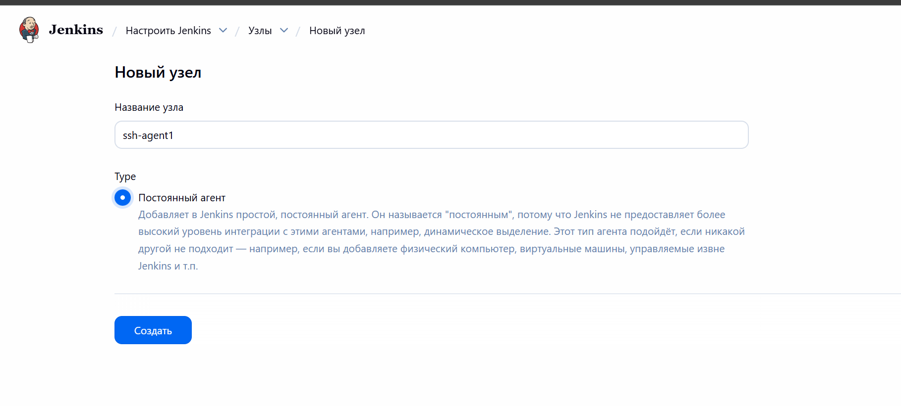

3. Метка `php-agent`.
4. Настраиваем узел, указав:
   - Remote root directory: `/home/jenkins/agent`
   - Launch method: `Launch agents via SSH`
   - Host: `ssh-agent`
   - Credentials: ранее добавленный SSH ключ

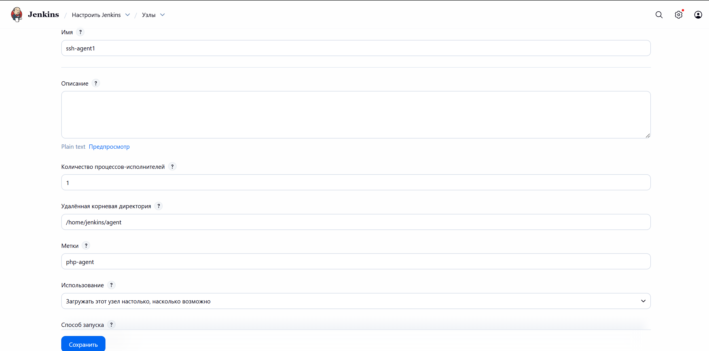
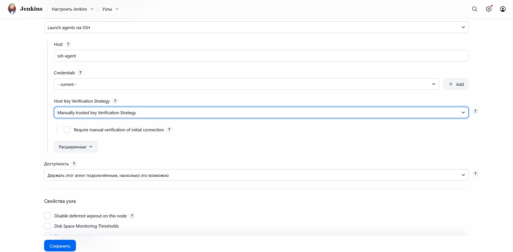

### Создание конвейера Jenkins для автоматизации задач DevOps

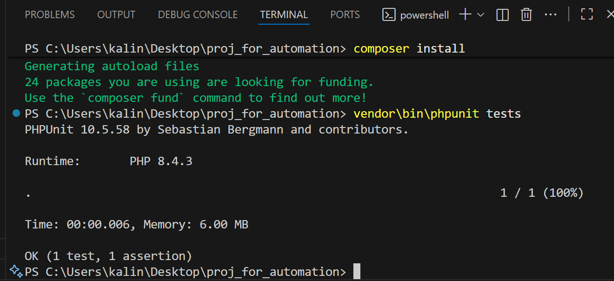
проверка локально

Создаю репозиторий с PHP проектом на GitHub (https://github.com/sonimoo/project_for_lab04). В проекте есть некоторые модульные тесты. Создаем новый конвейер Jenkins с использованием следующего `Jenkinsfile`:


```groovy
pipeline {
    agent { label 'php-agent' }

    stages {
        stage('PHP Lint') {
            steps {
                echo 'Проверка синтаксиса PHP...'
                sh '''
                for file in $(find src -name "*.php"); do
                    php -l "$file"
                done
                '''
            }
}

        stage('Install Dependencies') {
            steps {
                echo 'Установка зависимостей...'
                sh 'composer install || echo "composer не найден, пропускаем установку"'
            }
        }

        stage('Test') {
            steps {
                echo 'Запуск тестов...'
                sh 'vendor/bin/phpunit tests || echo "PHPUnit не найден, пропускаем тесты"'
            }
        }
    }

    post {
        always { echo 'Конвейер завершен.' }
        success { echo 'Все этапы прошли успешно!' }
        failure { echo 'Обнаружены ошибки в конвейере.' }
    }
}
```

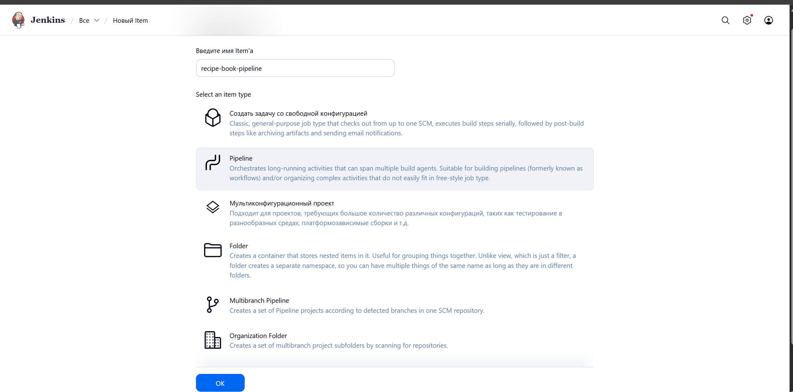
Создание нового проекта (New Item)

Выбрали Pipeline и дали имя

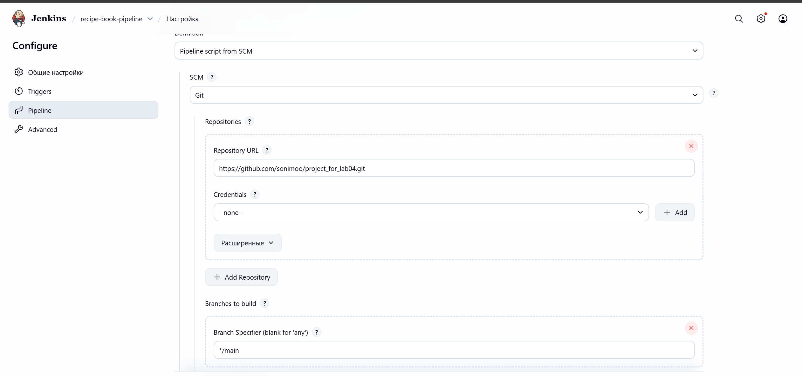

Указали Pipeline script from SCM (репозиторий GitHub).
В поле Repository URL указали ссылку с проектом

Branch Specifier: */main (основная ветка).

Script Path: Jenkinsfile (файл с инструкциями pipeline)

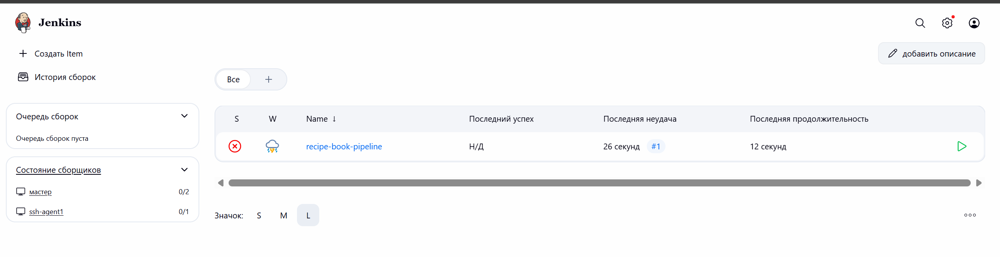
Москва не сразу строилась

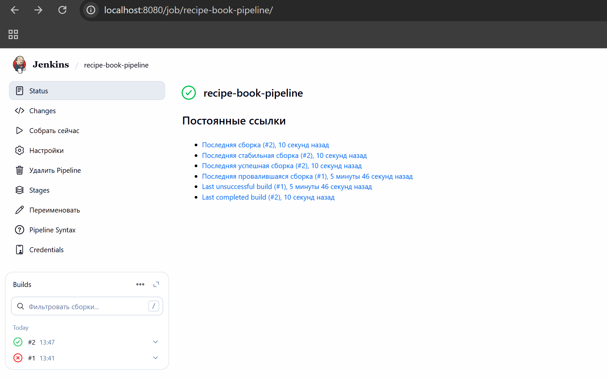

Добавила еще тест и опять нажала собрать сейчас.
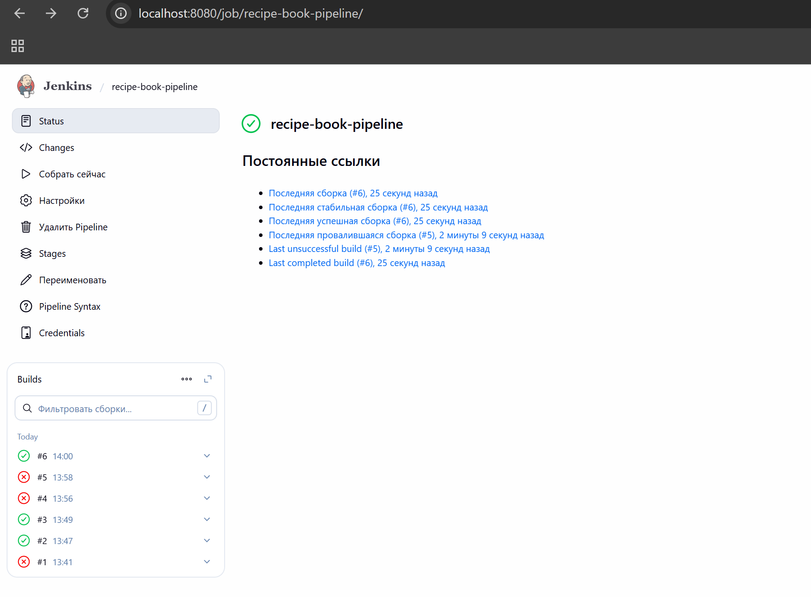
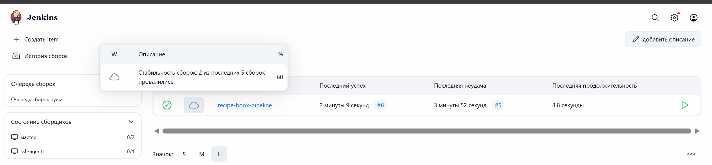

## Ответы на вопросы

**1. Какие преимущества использования Jenkins для автоматизации задач DevOps?**

- Jenkins помогает автоматизировать задачи, типа сборки, тестов и деплоя.
- Можно легко делать CI/CD — новые изменения сразу проверяются и разворачиваются.
- Огромное количество плагинов под разные технологии: Git, Docker, PHP и т.д.
- Можно подключать много агентов и запускать несколько задач параллельно.
- Всё видно в веб-интерфейсе: логи, статус сборки, отчёты — удобно отслеживать.

**2. Какие еще бывают агенты Jenkins?**

- SSH агенты — как у нас, подключение по SSH.
- Windows агенты — для задач на Windows.
- Docker агенты — запускаются в контейнерах.
- Kubernetes агенты — динамически создаются в кластере Kubernetes.
- Постоянные агенты — обычные машины, всегда подключённые к Jenkins.

**3. Какие проблемы вы столкнулись при настройке Jenkins и как вы их решили?**

- Иногда Jenkins капризничал с командами в Jenkinsfile, например ругался на \; в bash. Решили просто переписать на цикл for, и всё заработало.

- С SSH ключами тоже пришлось немного повозиться: нужно было правильно добавить ключ в Jenkins и выбрать его при настройке агента.

## Вывод

В ходе лабораторной работы мы настроили Jenkins для автоматизации сборки и тестирования PHP-проекта. Подняли контроллер, подключили SSH-агента, создали pipeline с простыми тестами. Полученный конвейер позволяет быстро проверять код и следить за результатами, что делает процесс разработки более удобным и безопасным.

## Источники

- [Курс про Jenkins](https://github.com/mcroitor/automation/blob/main/06_jenkins.md)
- [Официальная документация Jenkins](https://www.jenkins.io/doc/)
- [Jenkins Pipeline Syntax Guide](https://www.jenkins.io/doc/book/pipeline/syntax/)
