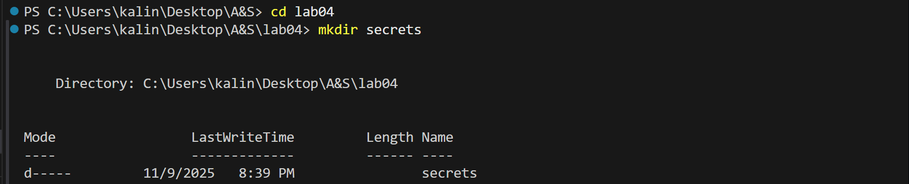
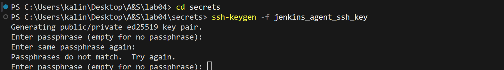
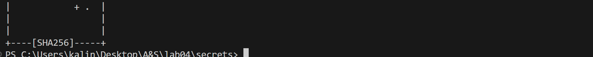
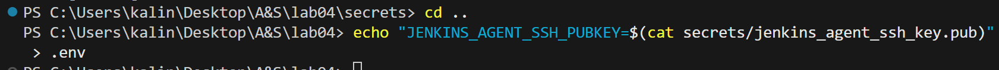
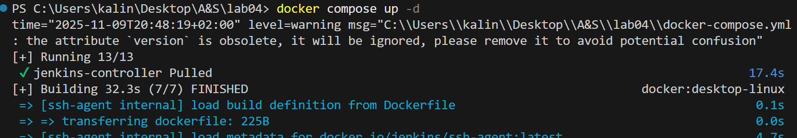
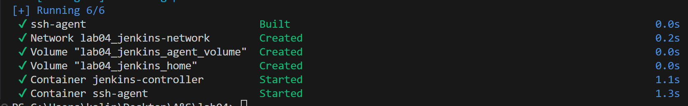
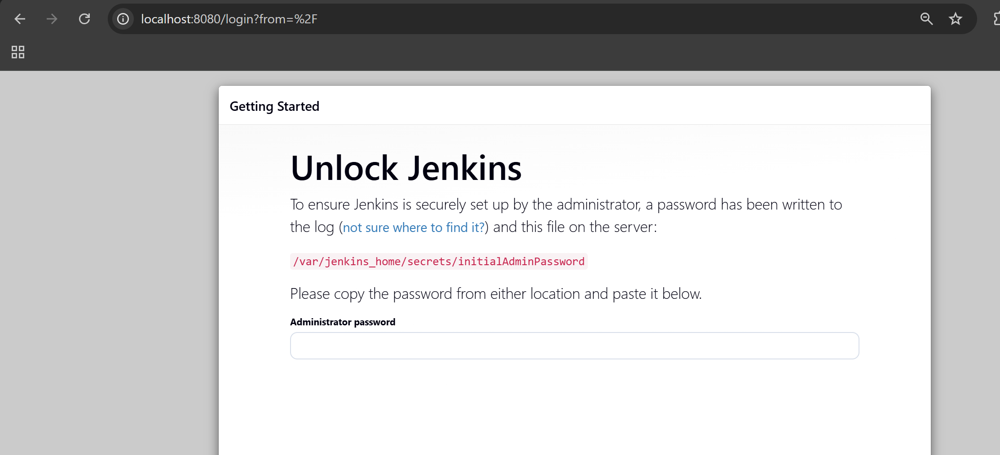
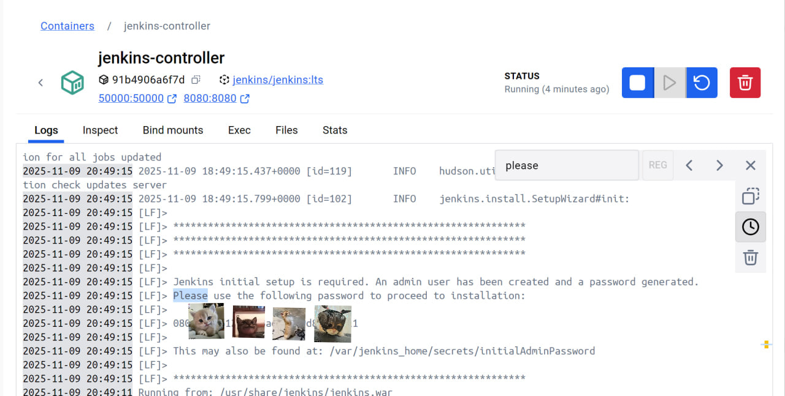
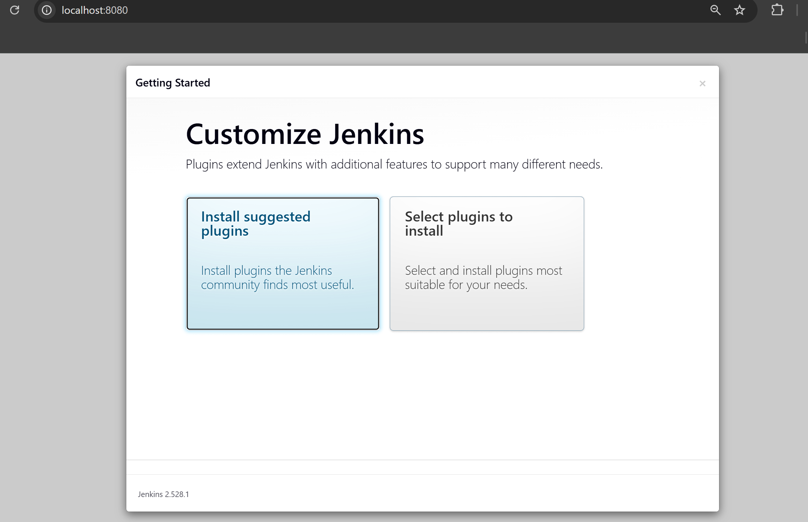
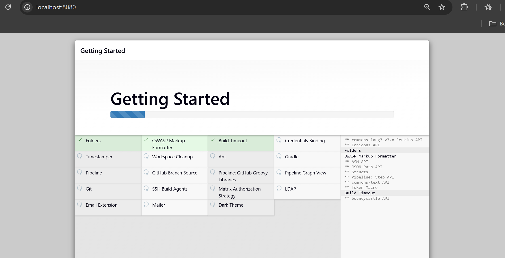

# Лабораторная работа №4. Настройка Jenkins для автоматизации задач DevOps
 
 - **Калинкова София, I2302** 
 - **09.11.2025**

## Цель

Научиться настраивать Jenkins для автоматизации задач DevOps, включая создание и управление конвейерами CI/CD.

## Подготовка

Создать папку `lab04` в репозитории GitHub для хранения всех файлов, связанных с этой лабораторной работой. Установлен Docker и Docker Compose для выполнения задания.

## Ход работы

Создаем `docker-compose.yml` файл и определяем в нем следующие сервисы:

1. **Jenkins Controller**
2. **SSH Agent**

### Подготовка контроллера Jenkins

Пропишите в `docker-compose.yml` файл конфигурацию для сервиса Jenkins Controller:

```yaml
services:
  jenkins-controller:
    image: jenkins/jenkins:lts
    container_name: jenkins-controller
    ports:
      - "8080:8080"
      - "50000:50000"
    volumes:
      - jenkins_home:/var/jenkins_home
    networks:
      - jenkins-network

volumes:
  jenkins_home:
  jenkins_agent_volume:

networks:
  jenkins-network:
    driver: bridge
```

Запустите контейнер Jenkins Controller с помощью Docker Compose и настройте его, следуя инструкциям на экране.

### Подготовка SSH агента

Создайте папку `secrets` в корне вашего проекта и добавьте туда SSH ключи, необходимые для подключения к удаленным серверам.

```bash
mkdir secrets
cd secrets
ssh-keygen -f jenkins_agent_ssh_key
```




Создайте файл `Dockerfile` для SSH агента с следующим содержимым:

```Dockerfile
FROM jenkins/ssh-agent

# install PHP-CLI
RUN apt-get update && apt-get install -y php-cli
```

Пропишите в `docker-compose.yml` файл конфигурацию для сервиса SSH Agent:

```yaml
  ssh-agent:
    build:
      context: .
      dockerfile: Dockerfile
    container_name: ssh-agent
    environment:
      - JENKINS_AGENT_SSH_PUBKEY=${JENKINS_AGENT_SSH_PUBKEY}
    volumes:
      - jenkins_agent_volume:/home/jenkins/agent
    depends_on:
      - jenkins-controller
    networks:
      - jenkins-network
```

Создайте файл `.env` в корне вашего проекта и добавьте туда переменную окружения `JENKINS_AGENT_SSH_PUBKEY`.



Docker ожидает, что файл .env сохранен в кодировке UTF-8 без BOM!!!


Перезапустите проект Docker Compose, чтобы применить изменения.





### Подключение SSH агента к Jenkins

1. Заходим в веб-интерфейс Jenkins по адресу `http://localhost:8080`.


ввожу пароль



2. Первичная настройка Jenkins

Выбираю “Install suggested plugins” жду, пока установятся плагины





Создаем пользователя (логин/пароль/имя)

Завершаем настройку, Jenkins запустится на главную страницу


Проверьте, что в Jenkins установлен плагин "SSH Agents Plugin". Если нет, установите его через `Manage Jenkins > Manage Plugins`.

Зарегистрируйте SSH ключи в Jenkins:

1. Войдите в веб-интерфейс Jenkins по адресу `http://localhost:8080`.
2. Перейдите в `Manage Jenkins > Manage Credentials`.
3. Добавьте новый SSH ключ, установив имя пользователя `jenkins` и выбрав соответствующий приватный ключ из папки `secrets`.

Добавьте новый узел агента Jenkins:

1. Перейдите в `Manage Jenkins > Manage Nodes and Clouds > New Node`.
2. Назовите узел `ssh-agent1`, выберите тип `Permanent Agent`
3. Добавьте метку `php-agent` для узла.
4. Настройте узел, указав:
   - Remote root directory: `/home/jenkins/agent`
   - Launch method: `Launch agents via SSH`
   - Host: `ssh-agent`
   - Credentials: выберите ранее добавленный SSH ключ

### Создание конвейера Jenkins для автоматизации задач DevOps

Выберите репозиторий с PHP проектом на GitHub (например, из курса `Программирование на PHP` или `Виртуализация и контейнеризация`). Проект должен содержать модульные тесты. Создайте новый конвейер Jenkins с использованием следующего `Jenkinsfile`:

```groovy
pipeline {
    agent {
        label 'php-agent'
    }
    
    stages {        
        stage('Install Dependencies') {
            steps {
                // Подготовка проекта (установка зависимостей, если необходимо)
                echo 'Подготовка проекта...'
                // Добавьте здесь команды специфичные для вашего проекта
            }
        }
        
        stage('Test') {
            steps {
                // Запуск тестов
                echo 'Запуск тестов...'
                // Добавьте здесь команды для запуска ваших тестов
            }
        }
    }
    
    post {
        always {
            echo 'Конвейер завершен.'
        }
        success {
            echo 'Все этапы прошли успешно!'
        }
        failure {
            echo 'Обнаружены ошибки в конвейере.'
        }
    }
}
```

Проверьте, что конвейер успешно выполняется, и модульные тесты проходят.

### Подготовка отчета

Создайте файл `readme.md` в папке `lab04` вашего репозитория GitHub. В отчете опишите следующие моменты:

1. Описание проекта.
2. Шаги по настройке Jenkins Controller
3. Шаги по настройке SSH агента
4. Шаги по созданию и настройке конвейера Jenkins
5. Ответьте на вопросы:
    - Какие преимущества использования Jenkins для автоматизации задач DevOps?
    - Какие еще бывают агенты Jenkins?
    - Какие проблемы вы столкнулись при настройке Jenkins и как вы их решили?
