# Лабораторная работа №5. Ansible playbook для конфигурации сервера

 - **Калинкова София, I2302** 
 - **30.11.2025**

## Цель

Научиться создавать Ansible playbook для автоматизации конфигурации серверов.

## Ход работы

## Шаг 1. Jenkins Controller (compose.yaml)

1. В папке `lab5` создаем файл `compose.yaml` с таким начальным содержимым:

```yaml
services:
  jenkins-controller:
    image: jenkins/jenkins:lts
    container_name: jenkins-controller
    ports:
      - "8080:8080"
      - "50000:50000"
    volumes:
      - jenkins_home:/var/jenkins_home
    networks:
      - jenkins-network
    restart: unless-stopped

volumes:
  jenkins_home:

networks:
  jenkins-network:
```

2. Запуск Jenkins

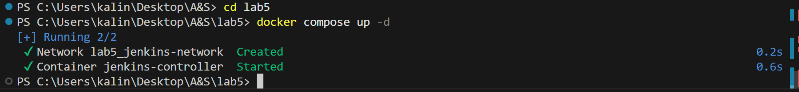

3. Открываем Jenkins в браузере

- Переходим : `http://localhost:8080`
- Пароль админа:

```bash
docker logs jenkins-controller
```
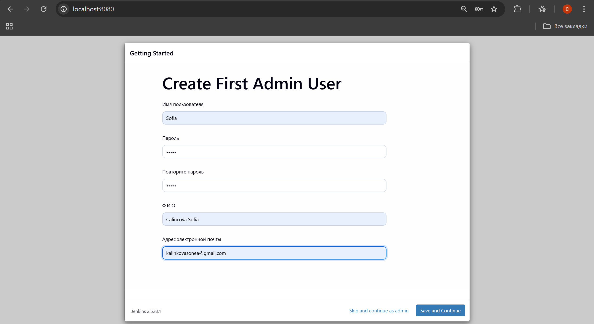

4. Установка плагинов

В **Manage Jenkins → Plugins → Available** Нахожу и устанавливаю:

  * `Docker`
  * `Docker Pipeline`
  * `GitHub Integration`
  * `SSH Agent`

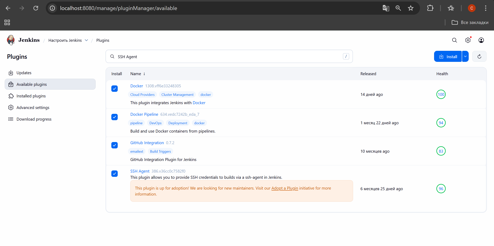

## ШАГ 2 — Создаём SSH агент для сборки PHP

1. Создаём [Dockerfile.ssh_agent](Dockerfile.ssh_agent) В папке `lab5`

2. Добавляем сервис `ssh-agent` в `compose.yaml`:

```yaml
  ssh-agent:
    build:
      context: .
      dockerfile: Dockerfile.ssh_agent
    container_name: ssh-agent
    ports:
      - "2222:22"
    networks:
      - jenkins-network
    restart: unless-stopped
```
3. Запускаем SSH-агент

```
docker compose up -d ssh-agent
```

4. Создаём SSH ключи для Jenkins → ssh-agent

```
ssh-keygen -t rsa -b 4096 -f ssh_agent_key
```

Появятся два файла:

* `ssh_agent_key` — приватный
* `ssh_agent_key.pub` — публичный

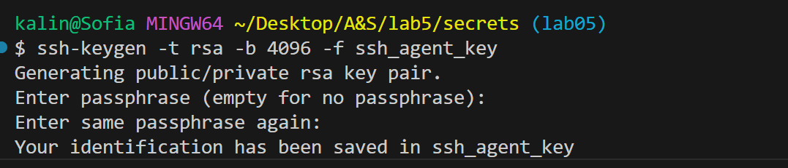

5. Добавляем ключ в контейнер SSH-агента

Зайдём в контейнер:

```
docker exec -it ssh-agent bash
```

Теперь внутри:

```
su jenkins
cd ~
mkdir .ssh
chmod 700 .ssh
```

```
echo "<содержимое ssh_agent_key.pub>" >> ~/.ssh/authorized_keys
chmod 600 ~/.ssh/authorized_keys
```
6. Регистрируем ключ в Jenkins

**Manage Jenkins → Credentials → System → Global → Add Credentials**

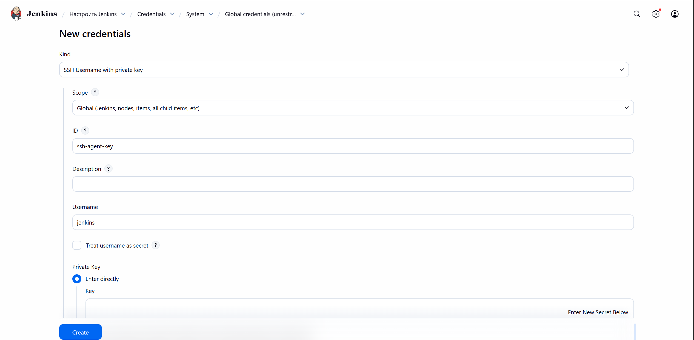

## ШАГ 3 — Создаём **Ansible агент**

1. Создаём файл `Dockerfile.ansible_agent`

[Dockerfile.ansible_agent](Dockerfile.ansible_agent)

2. Добавляем сервис `ansible-agent` в compose.yaml

```yaml
  ansible-agent:
    build:
      context: .
      dockerfile: Dockerfile.ansible_agent
    container_name: ansible-agent
    networks:
      - jenkins-network
    restart: unless-stopped
```

3. Запускаем ansible-agent

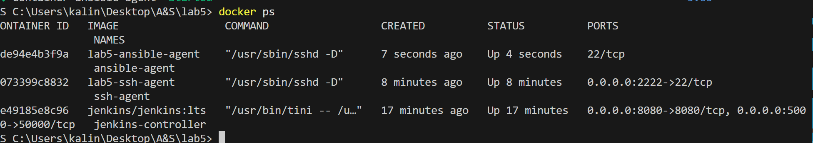

4. Создаём SSH ключ для Jenkins → ansible-agent

```
ssh-keygen -t rsa -b 4096 -f ansible_agent_key
```

5. Добавляем ключ ansible_agent_key в контейнер ansible-agent

Заходим в контейнер:

```
docker exec -it ansible-agent bash
```

```
echo "ssh-rsa AАблаблабла@Sofia" >> ~/.ssh/authorized_keys
chmod 600 ~/.ssh/authorized_keys 
```

6. Добавляем ключ в Jenkins

**Manage Jenkins → Credentials → System → Global → Add Credentials**

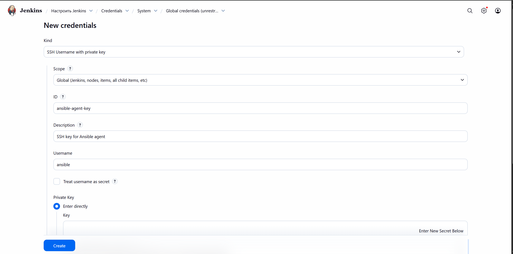

## ШАГ 4 — Создаём **Тестовый сервер** (Ubuntu + SSH + пользователь ansible)

1. Создаём файл `Dockerfile.test_server`

[Dockerfile.test_server](Dockerfile.test_server)

2. Добавляем сервис `test-server` в compose.yaml

```yaml
  test-server:
    build:
      context: .
      dockerfile: Dockerfile.test_server
    container_name: test-server
    ports:
      - "2224:22"
    networks:
      - jenkins-network
    restart: unless-stopped
```

3. Создаём SSH ключ для ansible-agent → test-server

```
ssh-keygen -t rsa -b 4096 -f test_server_key
```

4. Добавляем ключ на тестовый сервер

Загрузим контейнер:

```
docker compose up -d test-server
```

Зайдём:

```
docker exec -it test-server bash
```

Внутри:

```
su ansible
cd ~
mkdir .ssh
chmod 700 .ssh
```

Теперь вставляем публичный ключ из `test_server_key.pub`

```
echo "<публичный ключ>" >> ~/.ssh/authorized_keys
chmod 600 ~/.ssh/authorized_keys
```

5. Проверяем подключение из ansible-agent к test-server

```
ssh -i lab5/secrets/test_server_key ansible@localhost -p 2224
```

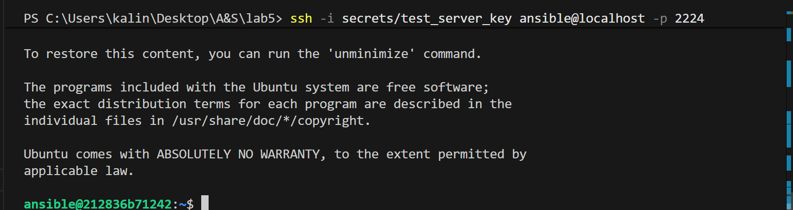

# ШАГ 5 — Создаём **Ansible инвентарь (hosts.ini)** и **playbook setup_test_server.yml**

1. Создаём папку `ansible`

2. Создаём файл `hosts.ini`

[ansible/hosts.ini](ansible/hosts.ini)

3. Скопировать приватный ключ в ansible-agent

Jenkins будет запускать playbook внутри **ansible-agent**. Значит, ему НУЖНО там иметь приватный ключ.

Выполним:

```
docker cp secrets/test_server_key ansible-agent:/home/ansible/.ssh/test_server_key
docker exec -it ansible-agent bash
```

Внутри:

```
su ansible
chmod 600 /home/ansible/.ssh/test_server_key
```

4. Создаем playbook `setup_test_server.yml`

[ansible/setup_test_server.yml](ansible/setup_test_server.yml)

5. Тест 

```
docker exec -it ansible-agent bash
```
```
su ansible
ansible-playbook -i /ansible/hosts.ini /ansible/setup_test_server.yml
```

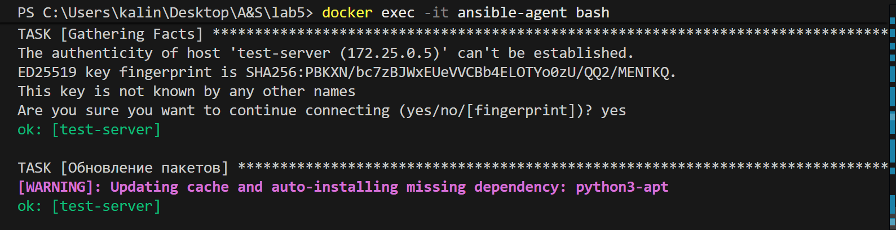
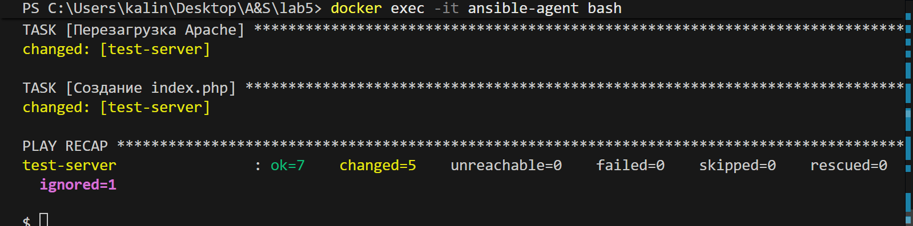

## ШАГ 6 — Pipeline: PHP Build & Test

1. Создаем файл:

[pipelines/php_build_and_test_pipeline.groovy](pipelines/php_build_and_test_pipeline.groovy)

2. Создаем pipeline job в Jenkins

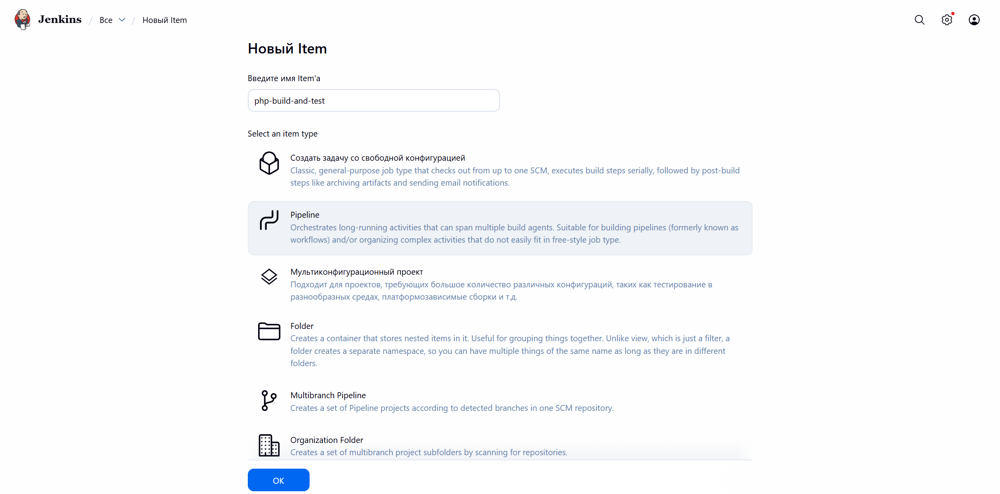

Pipeline script (и вставляю текст прямо сюда, но в предыдущих попыткам пробовала и с Pipeline script from SCM)

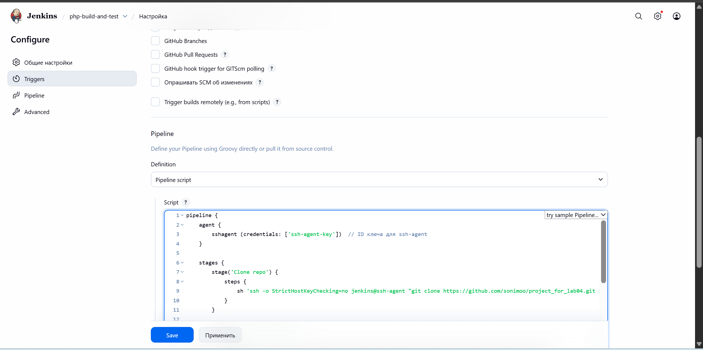

3. Запустим pipeline

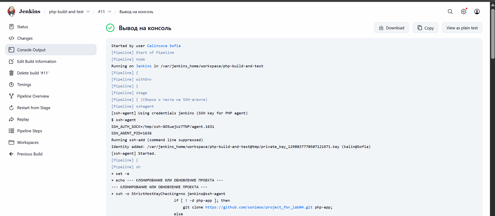

## Шаг 7 — Jenkins pipeline для запуска Ansible playbook

1. Создаем **ansible_setup_pipeline.groovy**

[pipelines/ansible_setup_pipeline.groovy](pipelines/ansible_setup_pipeline.groovy)

2. Создаем еще один pipeline и опять выбираю Pipeline script

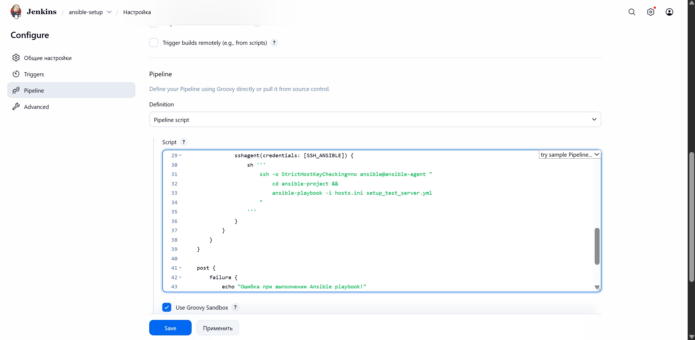
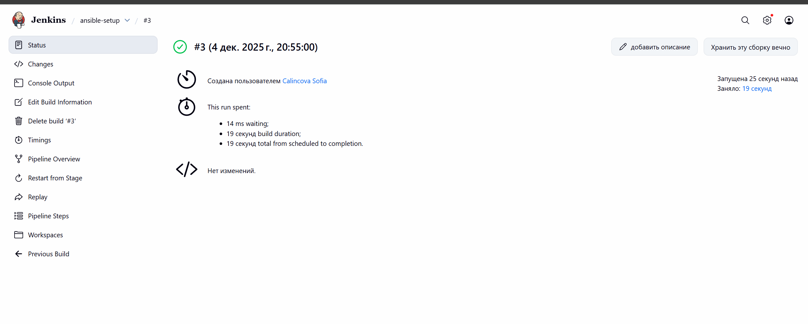

## ШАГ 8 — Деплой PHP проекта на тестовый сервер через Ansible

1. Создаём playbook `deploy_php.yml`

[ansible/deploy_php.yml](ansible/deploy_php.yml)

2. Копируем ansible/ в контейнер ansible-agent**

```
docker cp ansible/deploy_php.yml ansible-agent:/ansible/deploy_php.yml
```

3. Создаём Jenkins pipeline: `php_deploy_pipeline.groovy`**

[pipelines/php_deploy_pipeline.groovy](pipelines/php_deploy_pipeline.groovy)

4. Проверка вручную 

```
docker exec -it ansible-agent bash
su ansible
ansible-playbook -i /ansible/hosts.ini /ansible/deploy_php.yml
```

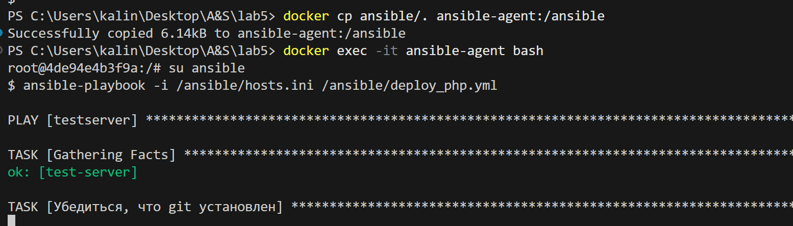
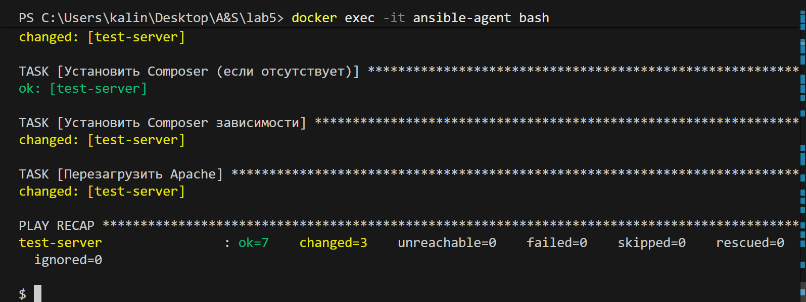

5. Создаем еще один pipeline 
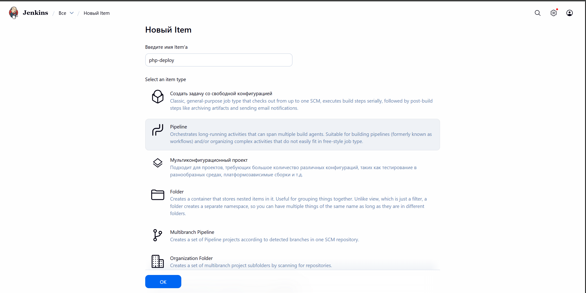
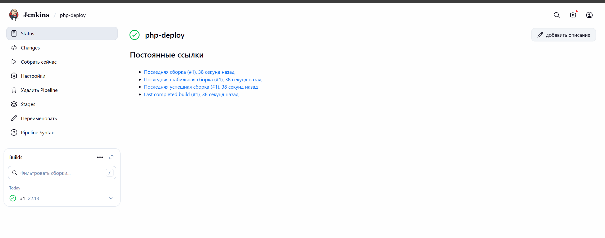

## Шаг 9 - Тестирование размещенного PHP проекта

После успешного выполнения этапов конвейера и развертывания приложения на тестовом сервере была выполнена проверка его работы.
Для этого в веб-браузере был открыт адрес тестового сервера: http://localhost:8081/

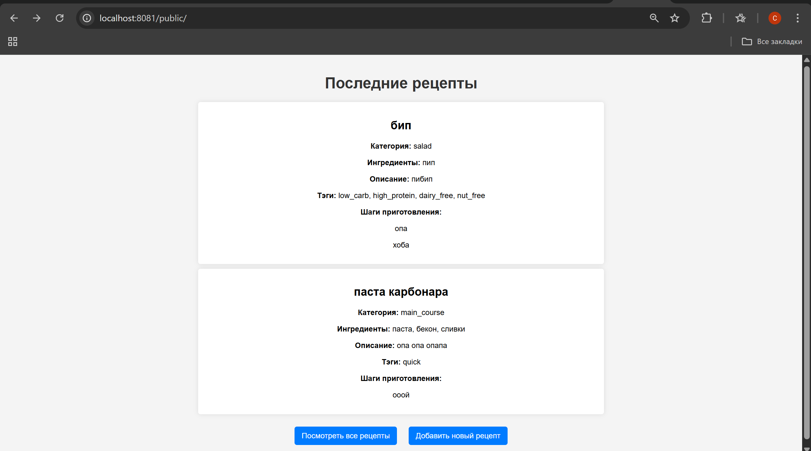

## Ответы на вопросы

### Преимущества использования Ansible

* Автоматизация рутинных задач.
* Единая и повторяемая конфигурация серверов.
* Нет агентов — работает через SSH.
* Простой и понятный YAML-синтаксис.

### Другие модули Ansible

* Работа с пакетами: **apt**, **yum**.
* Управление сервисами: **service**, **systemd**.
* Работа с файлами: **copy**, **template**, **file**.
* Пользователи: **user**, **group**.
* Docker: **docker_container**, **docker_image**.

### Проблемы и решения

* Ошибки SSH-подключения — исправила ключи (и не один раз) внутри контейнера и инвентори.
* Не был проброшен нужный порт (8081) — добавила его в docker-compose.
* После пересоздания контейнера пропали файлы — перезалила проект и снова запустила playbook. _Теперь твёрдо запомнила, что команду `docker compose down -v` лучше не применять без необходимости._-_-
* Иногда playbook “падал” из-за неправильного порядка задач — пришлось перенести установку зависимостей выше.
* Несколько раз playbook не видел хост, потому что я случайно меняла имя группы в инвентори.
* и тд : )

## Вывод

В ходе лабораторной работы было настроено окружение для автоматического развертывания PHP-проекта с использованием Docker, Jenkins и Ansible. Были созданы необходимые контейнеры, настроен тестовый сервер и реализован конвейер для сборки и развертывания приложения.

В результате PHP-проект был успешно размещён и протестирован на тестовом сервере, что подтвердило корректную работу всей настроенной инфраструктуры и автоматизации.

## Библиография

1. [Docker Documentation](https://docs.docker.com)
2. [Jenkins User Documentation](https://www.jenkins.io/doc/)
3. [Ansible Documentation](https://docs.ansible.com/)
4. ["Automation and Scripting" course](https://github.com/mcroitor/automation/tree/main)